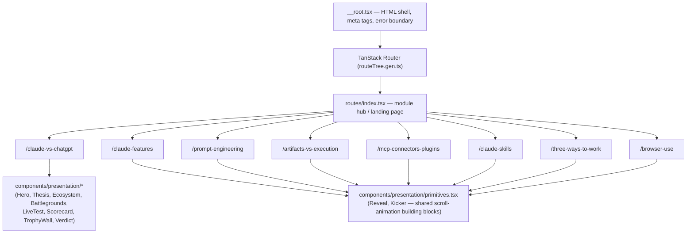

# Claude, Explained — An Interactive Course & Teardown

**A premium, visually-driven web app that teaches Claude in depth — from first principles to advanced workflows — through interactive teardowns, animated diagrams, and real side-by-side examples instead of walls of text.**

Built for people who want to actually *understand* Claude — not skim a feature list — this is the site I point my own students and clients to when they ask "okay but what can Claude really do, and how is it different?"

---

## 📖 Overview

Most AI tool explainers are either a marketing page or a wall of documentation. This project is neither — it's an **editorial, scroll-driven teardown site**, styled like a product deck from Stripe, Linear, or Notion, where every concept gets its own fully-designed, animated section: icons instead of bullet points, animated counters instead of static stats, and real recreated test scenarios instead of abstract claims.

The site is organized as eight standalone modules, each reachable from a central hub page:

| Module | What it covers |
|---|---|
| **Claude vs ChatGPT** | The definitive head-to-head teardown — depth, workflow, speed, and reach — including a full animated scorecard and a real recreated test (scheduling a LinkedIn post) run on both tools side by side. |
| **Claude: The Complete Features Overview** | A beginner's map to everything Claude can do — chat, skills, connectors, agents — in one visual reference. |
| **Prompt Engineering & Working With Claude** | From foundational prompting technique to "loop engineering," plus a full slash-command reference library. |
| **Artifacts vs. Code Execution** | Claude's two creation engines explained side by side — editable in-chat outputs vs. real, downloadable files — with concrete examples of when each one fires. |
| **Connectors, MCP & Plugins** | Claude's ecosystem explained like a smartphone: the OS, the apps, and the full suite of integrations. |
| **Claude Skills** | How to package your own expertise once, as a folder of instructions Claude loads automatically every time — with real-world examples across industries. |
| **Claude.ai vs Cowork vs Claude Code** | Same underlying intelligence, three very different jobs — when to chat, when to delegate, and when to build. |
| **Claude Cowork — Browser Use Flow** | The Goal → Browse → Extract → Structure flow, demonstrated with real prompts for n8n edits, Gmail drafts, and live research tasks. |

---

## ✨ Design Language

This isn't a generic docs site — every module was designed as its own full-height, visually distinct section:

- Deep near-black base with soft radial gradients and grain for depth
- Two consistent accent colors used as visual "tags" throughout (so the reader always knows what's being discussed without reading a label)
- Large, confident display typography with strong visual hierarchy — one idea per section, never a paragraph dump
- Icon for every single concept — **zero plain bullet lists**
- Scroll-triggered fade/slide-up animations, animated numeric counters, and a scroll-progress indicator with section nav dots
- Custom-built comparison tables and scorecards (never default HTML table styling) with animated bar comparisons and a colored glow on the winning side of each row
- Fully responsive, with hover states on every interactive element

---

## 🏗️ Architecture



The app is built on **TanStack Start** (React 19 + TanStack Router) with file-based routing — each module is its own route. The `claude-vs-chatgpt` module composes a set of dedicated, reusable presentation components (`Hero`, `Thesis`, `Ecosystem`, `Battlegrounds`, `LiveTest`, `Scorecard`, `TrophyWall`, `Verdict`); the other modules build on a shared set of lightweight animation primitives (`Reveal`, `Kicker`) so every section gets the same scroll-triggered, editorial feel without duplicating animation logic per page.

---

## 🛠️ Tech Stack

**Framework & Routing**
- [TanStack Start](https://tanstack.com/start) (React 19) — full-stack React framework with SSR
- [TanStack Router](https://tanstack.com/router) — type-safe, file-based routing

**UI & Motion**
- [shadcn/ui](https://ui.shadcn.com/) + [Radix UI](https://www.radix-ui.com/) primitives
- [Tailwind CSS v4](https://tailwindcss.com/)
- [Motion](https://motion.dev/) (`motion/react`) — scroll-triggered animations, parallax, animated counters
- [Lucide React](https://lucide.dev/) — icon system used for every concept on the site
- [Recharts](https://recharts.org/) — charts where used

**Build & Tooling**
- Vite 7 · TypeScript · ESLint · Prettier · Bun (package manager)

---

## 📂 Project Structure

```
mofi-ai-claude-course-main/
├── public/
│   └── favicon.ico
├── src/
│   ├── components/
│   │   ├── presentation/
│   │   │   ├── primitives.tsx      # Reveal, Kicker — shared scroll animation building blocks
│   │   │   ├── Hero.tsx
│   │   │   ├── Thesis.tsx
│   │   │   ├── Ecosystem.tsx
│   │   │   ├── Battlegrounds.tsx
│   │   │   ├── LiveTest.tsx
│   │   │   ├── Scorecard.tsx
│   │   │   ├── TrophyWall.tsx
│   │   │   ├── Verdict.tsx
│   │   │   ├── SideNav.tsx
│   │   │   └── FeaturesSideNav.tsx
│   │   ├── ThemeToggle.tsx
│   │   └── ui/                     # shadcn/ui component library
│   ├── routes/
│   │   ├── __root.tsx
│   │   ├── index.tsx                # module hub / landing page
│   │   ├── claude-vs-chatgpt.tsx
│   │   ├── claude-features.tsx
│   │   ├── prompt-engineering.tsx
│   │   ├── artifacts-vs-execution.tsx
│   │   ├── mcp-connectors-plugins.tsx
│   │   ├── claude-skills.tsx
│   │   ├── three-ways-to-work.tsx
│   │   └── browser-use.tsx
│   ├── router.tsx
│   └── server.ts
├── vite.config.ts
├── package.json
└── README.md
```

---

## 🚀 Getting Started

**Prerequisites:** [Bun](https://bun.sh/) (or Node.js + your package manager of choice)

```bash
# Install dependencies
bun install

# Start the dev server
bun run dev

# Build for production
bun run build

# Preview the production build locally
bun run preview
```

The dev server runs at `http://localhost:3000` by default.

---

## 👤 Author

Built by **Fhiroj Shaik** — Founder, MOFI AI. I teach AI automation and Claude workflows to 100+ students, and build production AI automation systems for clients worldwide.

🔗 **LinkedIn:** [linkedin.com/in/fhiroj-shaik-020760355](https://www.linkedin.com/in/fhiroj-shaik-020760355/)
🔗 **YouTube (MOFI AI):** [youtube.com/@mofiai123-f](https://youtube.com/@mofiai123-f)
